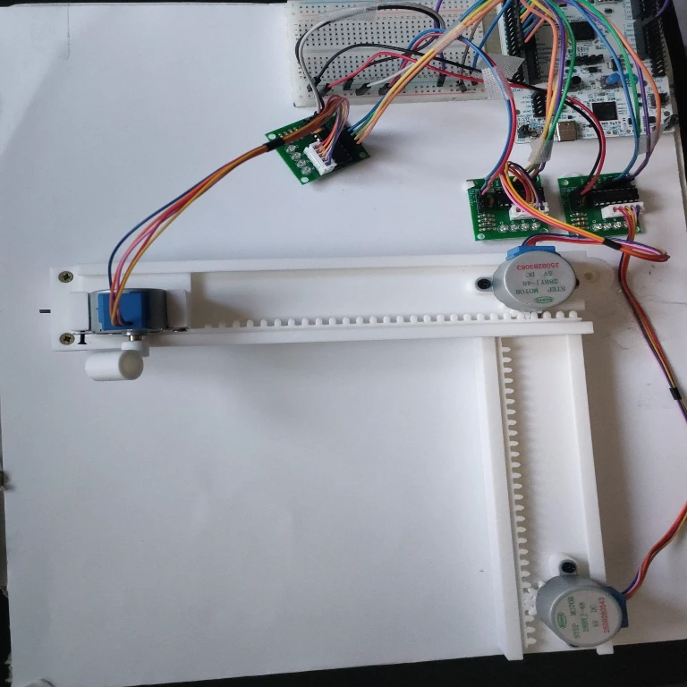

# 📠 STM32 Rust CNC Plotter

A 2D CNC Plotter built with **Rust (Embassy)** on an **STM32U5** microcontroller, capable of drawing complex vector graphics by interpreting standard G-code sent via a Python-based serial sender.

 


## 🛠️ Features
* **Asynchronous Embedded Rust:** Built entirely in `no_std` Rust utilizing the Embassy async framework for highly efficient, non-blocking hardware control.
* **Bresenham's Line Algorithm:** Implemented from scratch to ensure perfectly synchronized X and Y axis stepper motor movements for drawing smooth diagonal lines.
* **Robust UART Handshaking:** Uses a strict command-and-acknowledge protocol (with zero-byte filtering) via `usart::read_until_idle` to prevent buffer overrun and dropped commands.
* **Custom G-Code Parser:** Lightweight, custom-built parser that translates raw serial strings (e.g., `G1 X50 Y20`, `M3`, `M5`) into mathematical steps.

## ⚙️ Hardware Components (BOM)
* **Microcontroller:** STM32U545RE (Nucleo-64)
* **Motors:** 3x 28BYJ-48 Stepper Motors (Half-step mode, 4096 steps/rev)
* **Motor Drivers:** 3x ULN2003
* **Mechanics:** 3D Printed Rack and Pinion mechanism (XY axes + Z-axis for Pen Up/Down)
* **Misc:** Breadboard, jumper wires, pen/pencil, and standard 5V power supply.

## 🔌 Pinout Mapping

| Axis / Function | IN1 (Pin) | IN2 (Pin) | IN3 (Pin) | IN4 (Pin) |
| :--- | :--- | :--- | :--- | :--- |
| **X-Axis** | `PA7` | `PC9` | `PC6` | `PC7` |
| **Y-Axis** | `PB3` | `PC8` | `PA2` | `PA3` |
| **Z-Axis (Pen)**| `PB10`| `PB4` | `PB5` | `PA8` |

*Note: Serial communication (UART) uses `PA9` (TX) and `PA10` (RX), which are internally routed through the on-board ST-LINK Virtual COM Port.*

## 🚀 How to Run the Project

### 1. Flash the Firmware (STM32)
Ensure you have the Rust `nightly` toolchain and the required target (`thumbv8m.main-none-eabihf`) installed.
```bash
# Clone the repository
git clone [https://github.com/matei1608/CNC-PEN-PLOTTER](https://github.com/matei1608/CNC-PEN-PLOTTER.git)
cd CNC-PEN-PLOTTER

# Build and flash the firmware to the Nucleo board
cargo run --release

### 2. Send G-Code (PC)
The `sender.py` script requires Python 3 and the `pyserial` library.

```bash
# Install pyserial
pip install pyserial

# Run the sender script (make sure 'desen.gcode' is in the same folder)
python3 sender.py